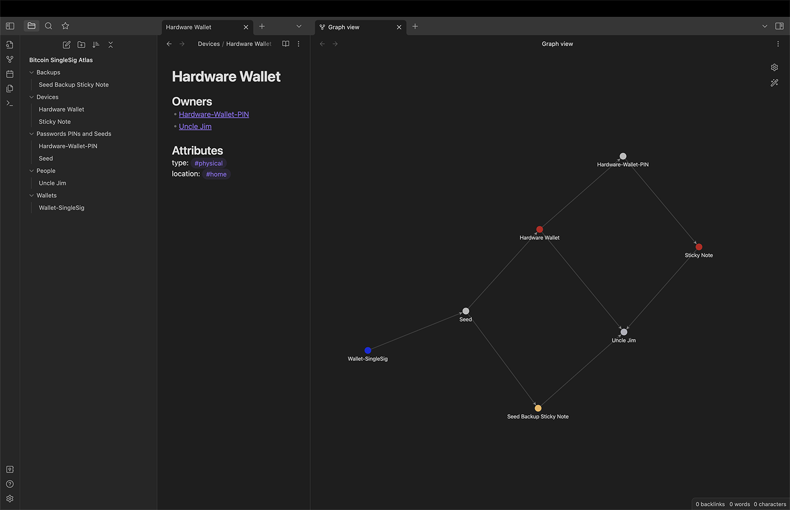
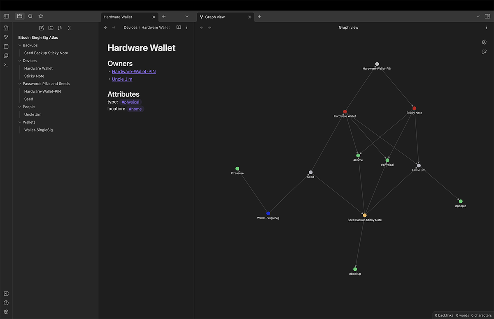
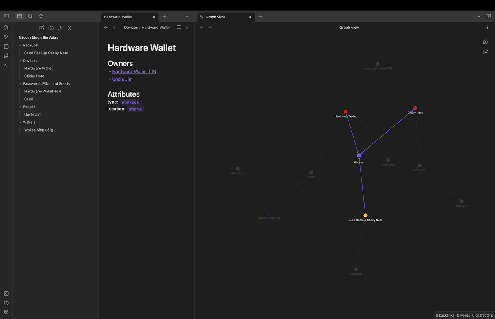
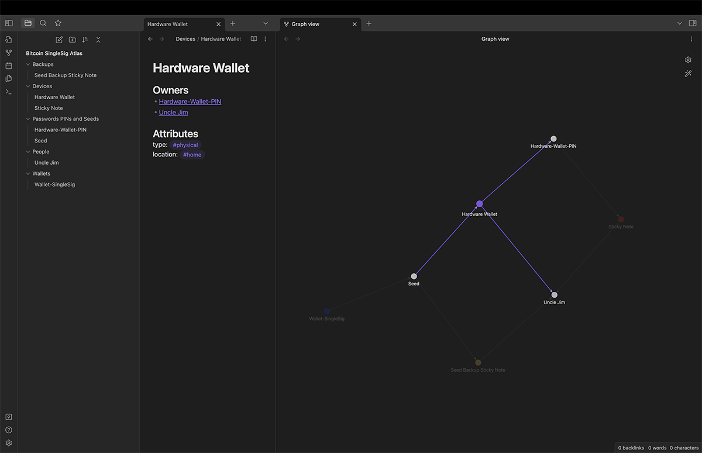

# Case Study: Bitcoin Key Management for a Single-Signature Wallet

Below is a simple configuration for a bitcoin wallet requiring a single signature. Every node is an object (device, person, password, etc) in a chain of custody culminating with the `Wallet-Single-Sig` (the utxo or treasure that is being protected). 

You can download the text files I used for this here: [_case-studies/bitcoin-singlesig](_case-studies/bitcoin-singlesig).

For readibility, I colored some of the nodes to indicate the following:
- Red denotes a physical device
- Yellow denotes a backup
- Blue denotes the treasure

The attributes in this case are organized by type, location, and make of an object. They appear as green nodes in the below image.

In this text editor, I can hover my mouse over a node (e.g., `home`) and see highlights of every other node that would be affected if `home` were to undergo an attack: e.g., a flood, fire, or burglary. This `home` attribute should be inherited by every downstream object; e.g., the `Seed` object is also susceptible to any `home`-related threat because both of its upstream owners are susceptible. This makes the `Wallet-SingleSig` object susceptible as well; this would be highlighted with a "threat path".

Selecting an object reveals all upstream and downstream relationships. In this case, the `Hardware Wallet` object requires both `Uncle Jim` as well as a `Hardware-Wallet-PIN` to access it, while the `Seed` relies on the `Hardware Wallet`. If anything were to happen to `Uncle Jim` or the `Hardware-Wallet-PIN`, the `Seed` would be in jeopardy.

### Next Case Study
Now let's dial up the complexity with a multisig wallet:
[03 Bitcoin Multi-Sig Wallet](03-Case-Study-Bitcoin-Multisig.md)
