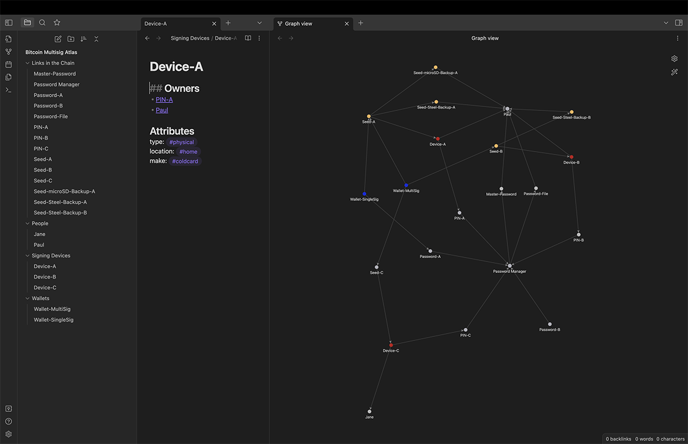
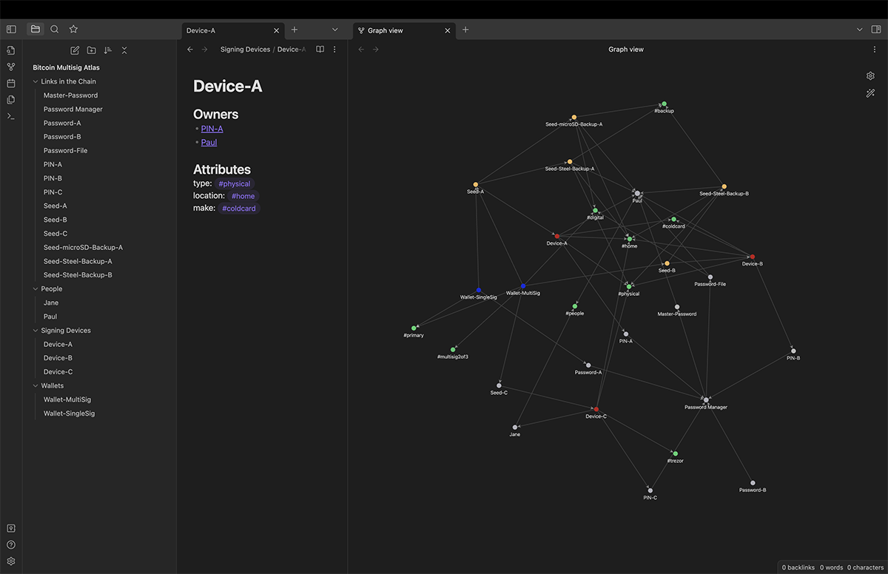
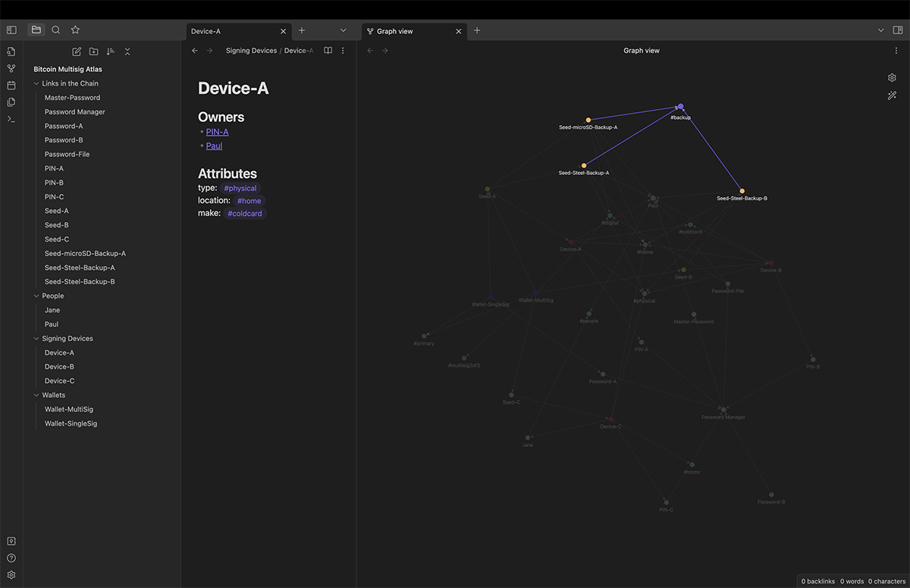
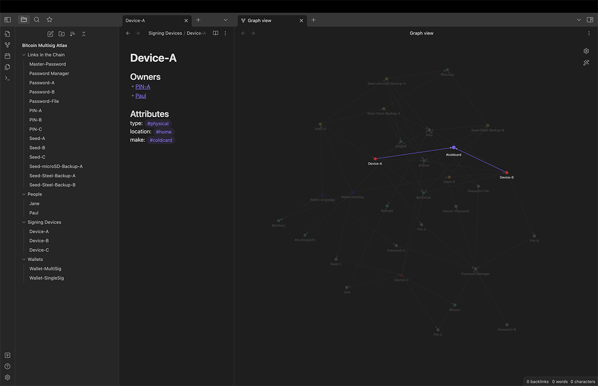

# Case Study: Bitcoin Key Management for a Multi-Signature Wallet

Things get immensely more complex when multiple devices and signatures. Below is a basic two-of-three multisig wallet; a glance of the knowlege graph reveals a number of hidden corners to analyze.

You can download the text files I used for this here: [_case-studies/bitcoin-multisig](_case-studies/bitcoin-multisig).

It gets even more convoluted when the attributes are turned on; imagine trying to do this in your head or on a piece of notebook paper.

In the image below, highlighting the "backups" attribute reveals that there are two separate backups for Seed-A, one backup for Seed-B, but no backups for Seed-C. This is where the program's warning lights would come on.

Further analysis could be done by comparing the attributes of Seed-A's two backups (are they stored in the same place? are they both susceptible to fire? etc.)

Some may find a security risk in a multisig setup if a quorum of devices come from the same manufacturer. In the image below, we see that Device-A and Device-B are both "Coldcards".

Going through this exercise will help you gain a much better understanding of the complete picture, of what happens behind the scenes (ie, out of reach of our limited brains). There is a balance between simplicity and threat avoidance: the nodes/connections/graph is simplified if everything is in one location, you choose only one manufacturer, you have no backups to keep up with, etc, but by doing those things you put your whole system at risk. By geographically separating objects, using multiple devices, making multiple backups, you minimize catastrophic failure, but in the process you've created a spider web of relationships. A knowledge graph helps you read and manage that web.
